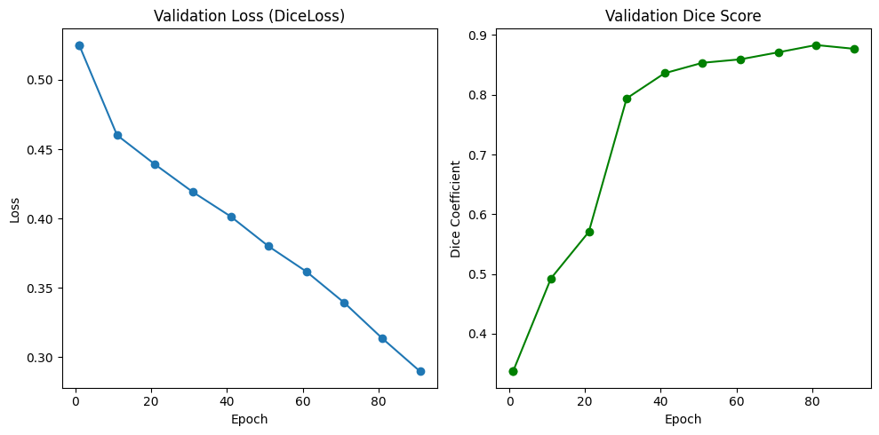
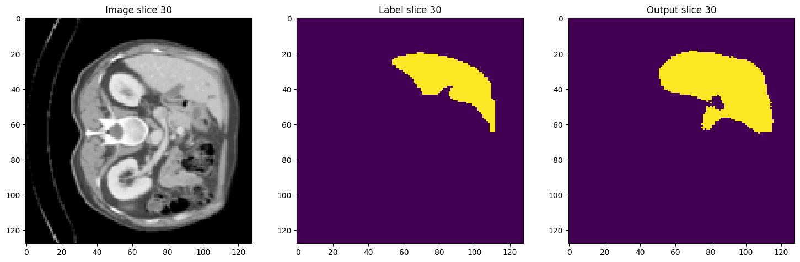

````markdown
# 🩸 Liver Segmentation using 3D UNet (MONAI)

This project demonstrates a **3D UNet-based deep learning model** trained with the [MONAI](https://monai.io/) framework for **automatic liver and tumor segmentation** from 3D CT scans.

---

## 📦 Dataset

The dataset used for training and testing comes from **Kaggle**:

🔗 [Liver Tumor Segmentation Dataset (Kaggle)](https://www.kaggle.com/datasets/andrewmvd/liver-tumor-segmentation)

This dataset contains volumetric CT scans with manually annotated liver and tumor masks.

---

## 🧠 Model Overview

| Property | Description |
|-----------|-------------|
| **Architecture** | 3D UNet (MONAI) |
| **Input channels** | 1 (CT grayscale) |
| **Output channels** | 2 (liver, background) |
| **Feature channels** | (16, 32, 64, 128, 256) |
| **Loss Function** | Dice Loss (softmax) |
| **Optimizer** | Adam (`lr=1e-5`, `weight_decay=1e-5`) |
| **Frameworks** | PyTorch + MONAI |
| **Training** | Google Colab (GPU) |

---

## 🤗 Pretrained Model

The trained model is publicly available on Hugging Face:

🔗 **[ali8461/liver_unet](https://huggingface.co/ali8461/liver_unet)**

You can download and use it directly in PyTorch:

```python
from monai.networks.nets import UNet
from monai.networks.layers import Norm
from huggingface_hub import hf_hub_download
import torch

# Download model weights
model_path = hf_hub_download(repo_id="ali8461/liver_unet", filename="pytorch_model.bin")

# Recreate the same architecture
model = UNet(
    spatial_dims=3,
    in_channels=1,
    out_channels=2,
    channels=(16, 32, 64, 128, 256),
    strides=(2, 2, 2, 2),
    num_res_units=2,
    norm=Norm.BATCH,
)

# Load weights
state_dict = torch.load(model_path, map_location="cpu")
model.load_state_dict(state_dict)
model.eval()

print("✅ Model loaded successfully!")
````

---

## 📊 Training and Evaluation

The model was trained for **100 epochs** using 3D CT scans and validated on a held-out test set.

### 🧩 Learning Curve



> Example: Dice score vs Epochs — showing model improvement over training.

### 🧠 Sample Test Results



> The model accurately segments the liver region and distinguishes it from surrounding tissue.

---

## 📁 Repository Contents

This repository only contains documentation and results.
All code used for:

* Preprocessing,
* Training,
* Evaluation, and
* Model upload to Hugging Face
  was developed in Google Colab.

---

## 🧰 Dependencies (used in Colab)

| Library         | Version |
| --------------- | ------- |
| Python          | ≥3.9    |
| MONAI           | ≥1.4.0  |
| PyTorch         | ≥2.3.0  |
| NumPy           | ≥1.24   |
| nibabel         | ≥5.2    |
| huggingface_hub | ≥0.24   |

---

## 👨‍💻 Author

**Ali** — AI and Data Engineer

* 🤗 [Hugging Face Profile](https://huggingface.co/ali8461)
* 💻 [GitHub Profile](https://github.com/ali8461)

---

## 🧾 License

This project is shared under the **MIT License**.
You may use and modify the model for research and educational purposes.

---

## 🌟 Acknowledgements

* [MONAI](https://monai.io/) — Medical Open Network for AI
* [Kaggle Liver Tumor Segmentation Dataset](https://www.kaggle.com/datasets/andrewmvd/liver-tumor-segmentation)
* [Hugging Face Hub](https://huggingface.co/) for model hosting

---

> 🩺 *This model contributes to automated medical image segmentation for liver and analysis in CT scans.*
